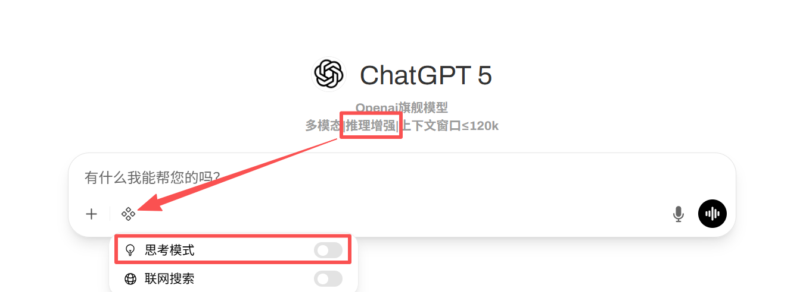

# wanglab-ai-server-updates

## TODO
- [ ] Complete usage tutorial

## 2025-11-24
### New Features
- Added two local models  
- Introduced the "Thinking Switch" feature  

### More Details
- Added [Qwen-3-VL-32B-Instruct](https://huggingface.co/Qwen/Qwen3-VL-32B-Instruct)  
  and [GPT-OSS-120B](https://huggingface.co/openai/gpt-oss-120b) as two local models.  
    - Fully localized data processing
    - Maximum privacy protection 

- Introduced the **Thinking Switch** for models with “Reasoning Enhancement” capability.  When enabled, it allows for superior inference  (chinese: 推理增强) and analytical performance.([Technical Details](supplement/11-24-2025-think-switch.md))  

- **Grok 4.1** has removed its filtering system, improving interaction freedom.

## 2025-11-20

### New Features
- Significantly optimized response speed for GPT Series.
- Added truncation function to reduce error possibilities.([Technical Details](supplement/11-20-2025-truncation-filter.md))

### More Details
- Optimized response speed for GPT 4o/4.1/5/5.1 models.
- Introduced smart truncation function to manage context length and prevent errors.  

## 2025-11-19

### New Features
- Added **Online Search** button.
- Added **Context Round Truncation** feature for dialogues.
- Updated latest three models.
- Improved model descriptions for better usability.
- New **Document Retrieval** and **Hybrid Query** functionality.

### More Details
- Added:
    - “Web Search” toggle button for convenient online search.
    - Context message truncation for multi-turn conversations to improve stability and reduce token usage.
    

- Updated Models:
    - Gemini 3 Pro
    - Grok 4
    - Grok 4.1

- Introduced a new document retrieval pipeline with hybrid query capabilities.  
    - Current pipeline:
        - **OCR**: Mistral OCR
        - **Embedding**: Qwen3-Embedding-8B  
            - Chunk size: 2048  
            - Chunk overlap: 256
        - **Hybrid search reranking**: Qwen3-Reranker-8B ([Technical Details](supplement/11-19-2025-qwen3-rerank-8b.md))  
            - `top_k`: 10  
            - `top_k_rank`: 5  
            - Score threshold: 0.4

## License

This project is licensed under the Apache License 2.0 - see the [LICENSE](LICENSE) file for details.
        

